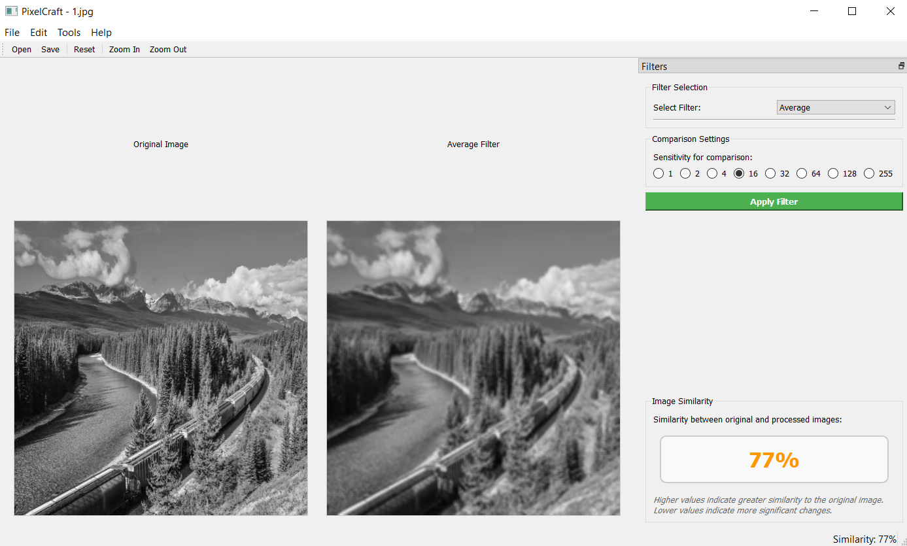
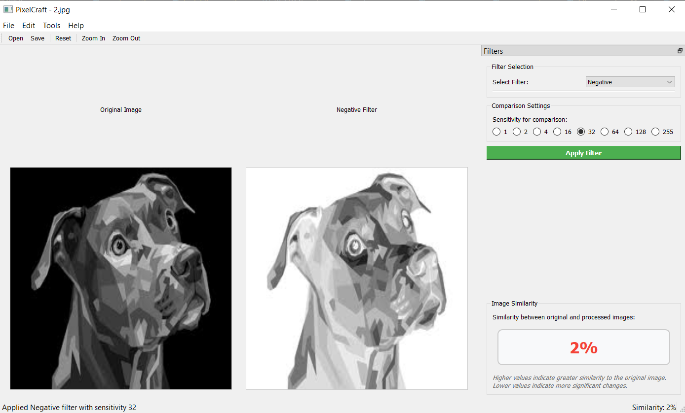
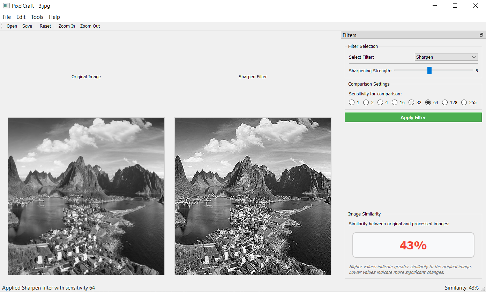
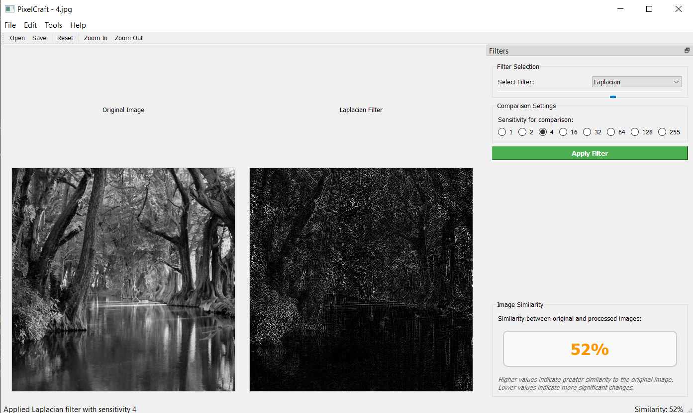
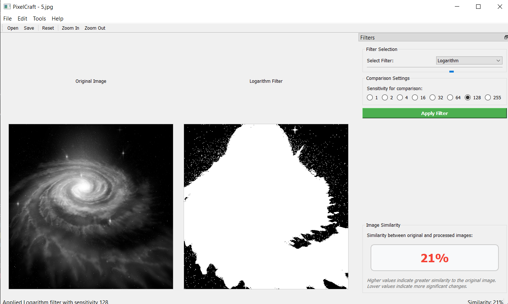

# PixelCraft


PixelCraft is a professional image processing application that enables users to apply various filters to digital images and analyze pixel-level similarities. Originally developed as an academic project, it has been refactored for professional use with a modern user interface and extended functionality.

<div align="center"> <table> <tr> <td></td> <td></td> </tr> <tr> <td></td> <td></td> </tr> <tr> <td></td> <td></td> </tr> </table> </div>

## Features

- **Image Filtering**: Apply various filters to your images:
  - Average (Blur)
  - Negative
  - Sharpen
  - Laplacian (Edge Detection)
  - Logarithm

- **Similarity Analysis**: Measure and visualize pixel-level similarity between original and processed images with adjustable sensitivity

- **Modern Interface**: User-friendly GUI with side-by-side comparison view

- **Professional Tools**:
  - Batch processing capabilities
  - Configurable filter parameters
  - Multi-format image support
  - Save and export processed images

## Installation

### Prerequisites

- Python 3.8 or higher
- pip (Python package installer)

### Option 1: Install from PyPI

```bash
pip install pixelcraft
```

### Option 2: Install from source

```bash
# Clone the repository
git clone https://github.com/KadirGokdeniz/pixel-craft-image-processor.git
cd pixel-craft-image-processor

# Install dependencies
pip install -r requirements.txt

# Install the package in development mode
pip install -e .
```

## Usage

### Starting the application

```bash
# If installed from PyPI
pixelcraft

# If installed from source
python -m pixelcraft
```

### Basic workflow

1. Open an image using the "File > Open Image" menu or the toolbar button
2. Select a filter from the filter panel on the right
3. Adjust sensitivity and other parameters as needed
4. Click "Apply Filter" to process the image
5. View the original and processed images side by side
6. Save the processed image using "File > Save Processed Image"

### Code example

```python
from pixelcraft.core.filters import ImageFilters
from pixelcraft.utils.image_io import ImageIO

# Load an image
image = ImageIO.read_image("path/to/image.jpg")

# Create a filter instance
filters = ImageFilters()

# Apply a filter
processed = filters.sharpen_filter(image)

# Save the processed image
ImageIO.save_image(processed, "path/to/output.jpg")

# Calculate similarity
from pixelcraft.core.similarity import calculate_similarity
similarity = calculate_similarity(processed, image, sensitivity=16)
print(f"Similarity: {similarity}%")
```

## Project Structure

```
pixel-craft-image-processor/
├── src/
│   ├── __init__.py
│   ├── core/
│   │   ├── __init__.py
│   │   ├── filters.py      # Filter algorithms
│   │   ├── similarity.py   # Similarity calculations
│   ├── gui/
│   │   ├── __init__.py
│   │   ├── main_window.py  # Main GUI components
│   │   ├── filter_panel.py # Filter control panel
│   ├── utils/
│   │   ├── __init__.py
│   │   ├── image_io.py     # Image reading/writing
│   │   ├── config.py       # Configuration
├── tests/
│   ├── __init__.py
│   ├── test_filters.py
│   ├── test_similarity.py
├── resources/
│   ├── images/             # Sample images
│   ├── icons/              # GUI icons
├── README.md
├── requirements.txt
├── setup.py
├── main.py                 # Application entry point
```

## Development

### Setting up the development environment

```bash
# Create a virtual environment
python -m venv venv
source venv/bin/activate  # On Windows: venv\Scripts\activate

# Install development dependencies
pip install -r requirements-dev.txt
```

### Running tests

```bash
# Run all tests
python -m unittest discover

# Run a specific test module
python -m unittest tests.test_filters

# Run with coverage
coverage run -m unittest discover
coverage report
coverage html  # Generate HTML report
```

### Building the package

```bash
# Build the package
python setup.py sdist bdist_wheel
```

## Contributing

Contributions are welcome! Please feel free to submit a Pull Request.

1. Fork the repository
2. Create your feature branch (`git checkout -b feature/amazing-feature`)
3. Commit your changes (`git commit -m 'Add some amazing feature'`)
4. Push to the branch (`git push origin feature/amazing-feature`)
5. Open a Pull Request

Please ensure your code passes all tests and follows the project's coding style.

## License

This project is licensed under the MIT License - see the LICENSE file for details.

## Acknowledgements

* Original project developed as part of an academic assignment
* OpenCV library for image processing algorithms
* PyQt5 for the modern user interface
* All contributors and users of the software

---

Made with ❤️ by [Kadir Gökdeniz](mailto:kadirqokdeniz@hotmail.com)
